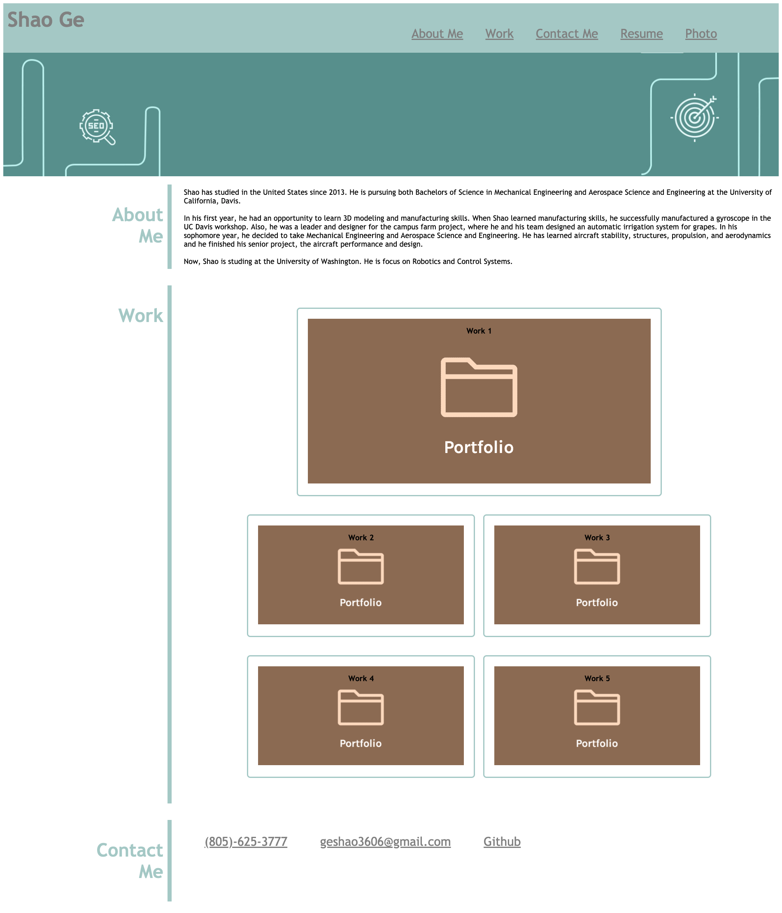

# MyPortfolio

## Task
In the given scenario , an employer wants to view a potential employee's deployed portfolio of work samples
SO THAT I can review samples of their work and assess whether they're a good candidate for an open position.

## Finished Requirements
Sample of previous work (work)\
Navigation Links\
Photo and Name\
Images\
Contact\
Layout\

## Details in Code
[MyPortfolio](https://sg3606.github.io/MyPortfolio/.)
[Index](./index.html)\
\
Images use in Portforlio
(https://oceanwp.org/extension/ocean-portfolio/)
(https://jessicaroots.com/project/black-friday/portfolio-background-header/)
